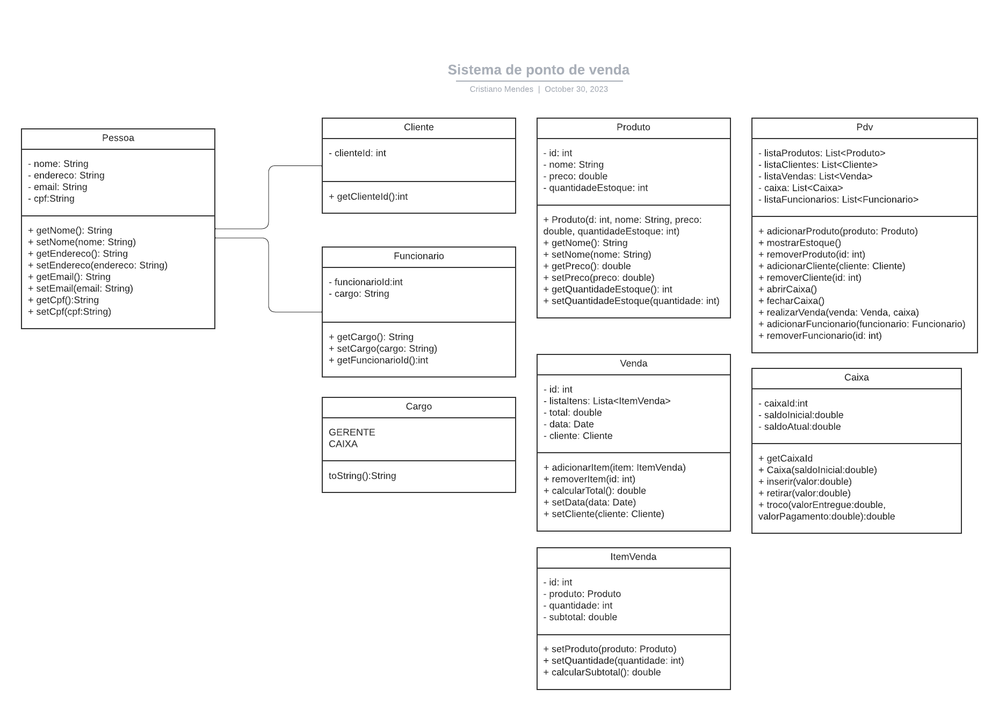

# Sistema de ponto de venda (PDV)

## Estado do Projeto

- Status: em andamento

Este é o projeto final desenvolvido como parte da disciplina de Programação Orientada a Objetos (POO) na Universidade Federal do Ceará (UFC).

## Tecnologias Utilizadas

- Linguagem de Programação: Java
- Banco de Dados: PostgreSQL
- Framework de Desenvolvimento: JavaFX

## Diagrama UML

## Descrição do Projeto

O sistema permite a gestão de produtos, clientes, funcionários e vendas em um ambiente
de varejo. Com ele, é possível registrar vendas, controlar estoques e administrar usuários
de forma eficiente.

## Licença

MIT

