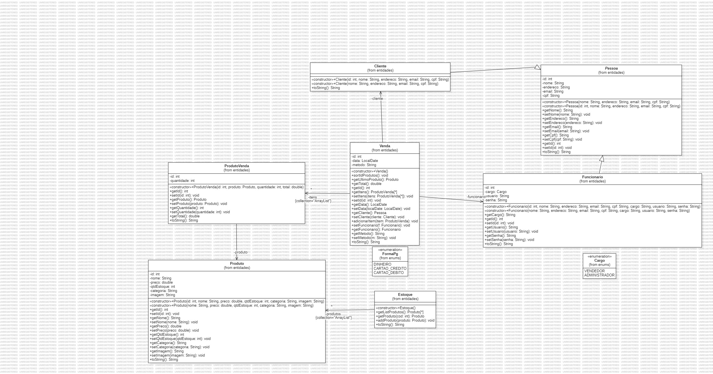
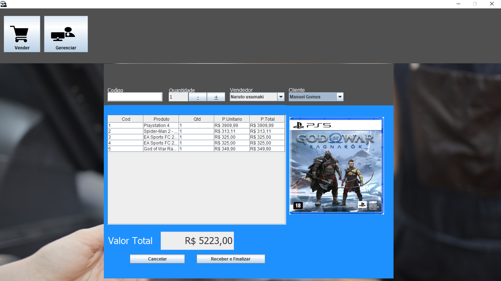
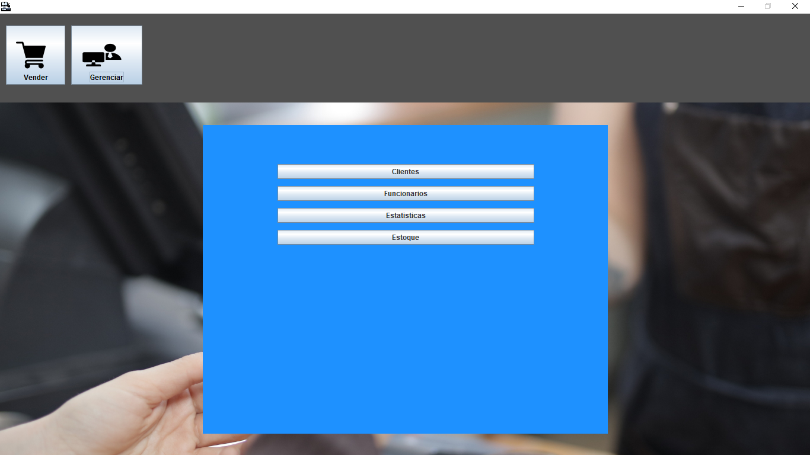
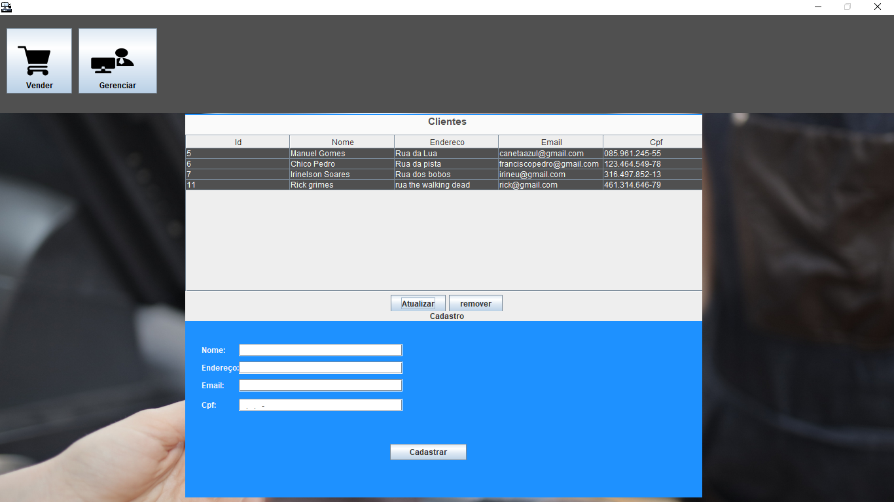
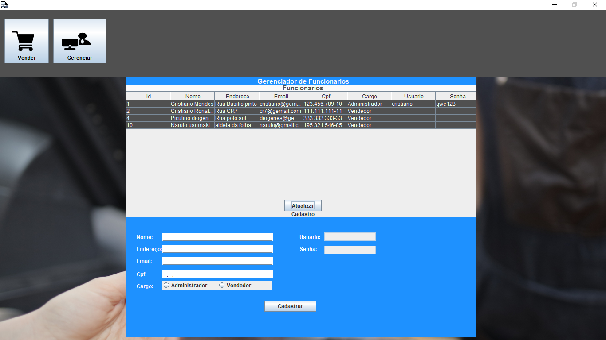
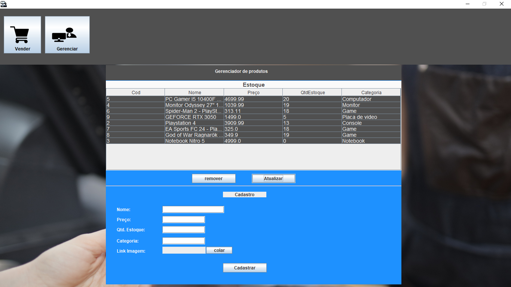
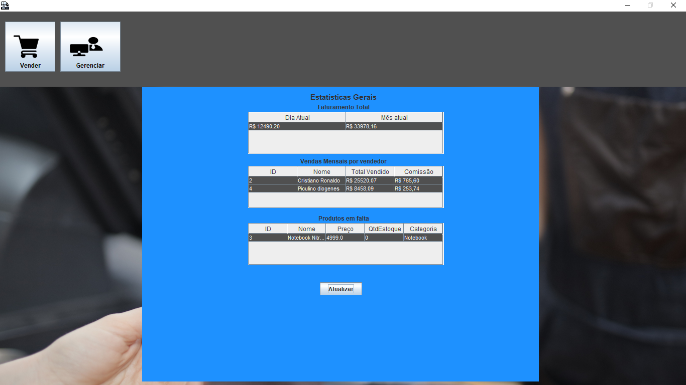

# Sistema de ponto de venda (PDV)

- [Descrição do Projeto](#descrição-do-projeto)
- [Tecnologias Utilizadas](#tecnologias-utilizadas)
- [Diagramas](#diagramas)
- [Capturas de Tela](#capturas-de-tela)
- [Vídeos](#vídeos)
- [Licença](#licença)

## Descrição do Projeto
O sistema permite a gestão de produtos, clientes, funcionários e vendas em um ambiente
de varejo. Com ele, é possível registrar vendas, controlar estoques, administrar usuários e vender produtos.

## Tecnologias Utilizadas

- Linguagem de Programação: Java
- Banco de Dados: PostgreSQL
- Bibliotecas: Java Swing, PostgreSQLJDBC
- Ferramentas: WindowBuilder, StarUML

## Diagramas
| Diagrama do banco de dados | Diagrama UML |
|----------------|---------------------------|
|  |  |

## Capturas de tela

| Tela de vendas | Seleção de gerenciamento |
|----------------|---------------------------|
|  |  |

| Gerenciamento de clientes | Gerenciamento de funcionários |
|---------------------------|-------------------------------|
|  |  |

| Gerenciamento de produtos | Tela de estatísticas de venda |
|--------------------------|-------------------------------|
|  |  |

## Vídeos
Abaixo encontra-se os videos com demostração do sistema.

### Interface

### Banco de dados

### Codigo

## Licença
Este projeto é licenciado sob os termos da [Licença MIT](LICENSE).
